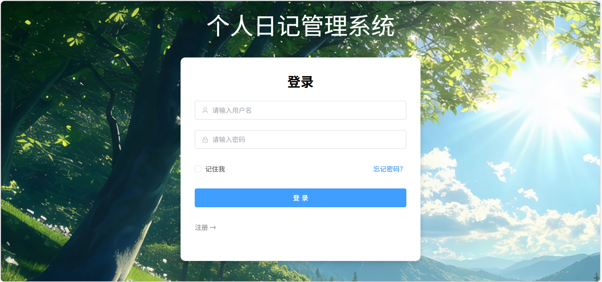
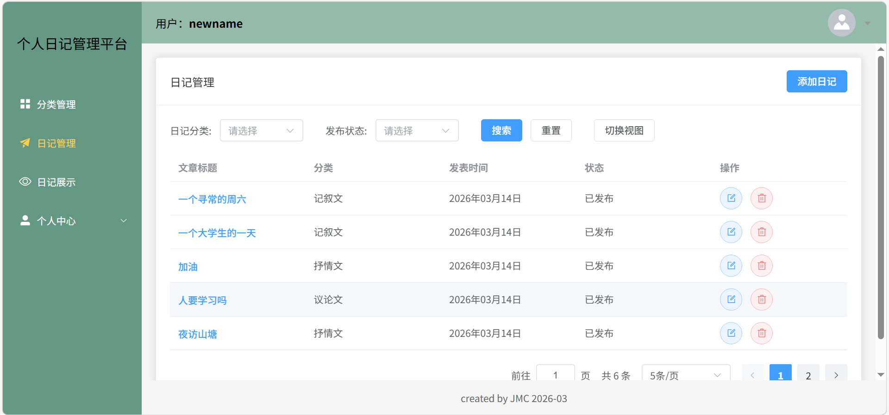
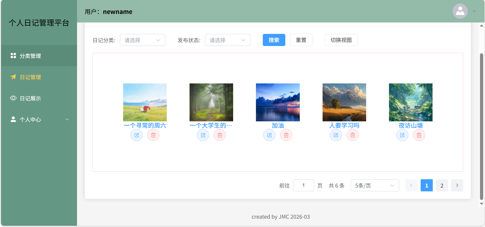
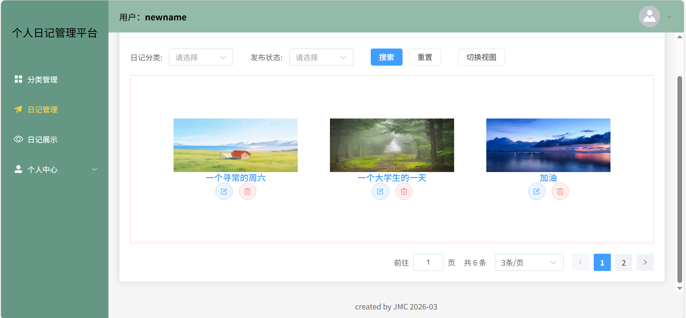
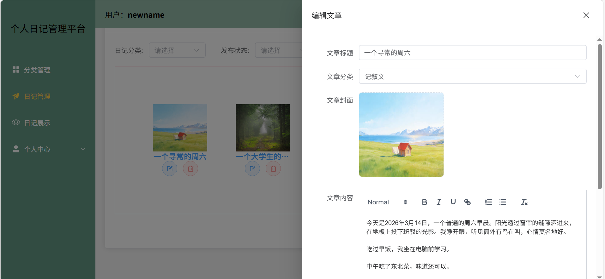
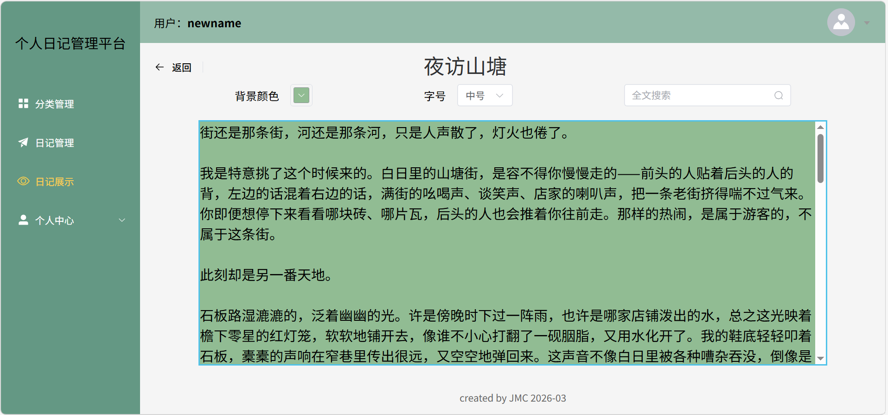
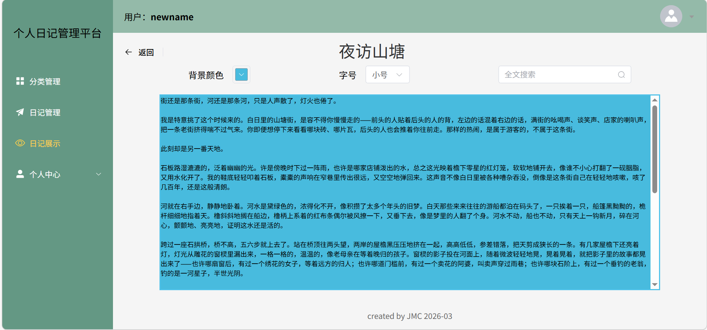
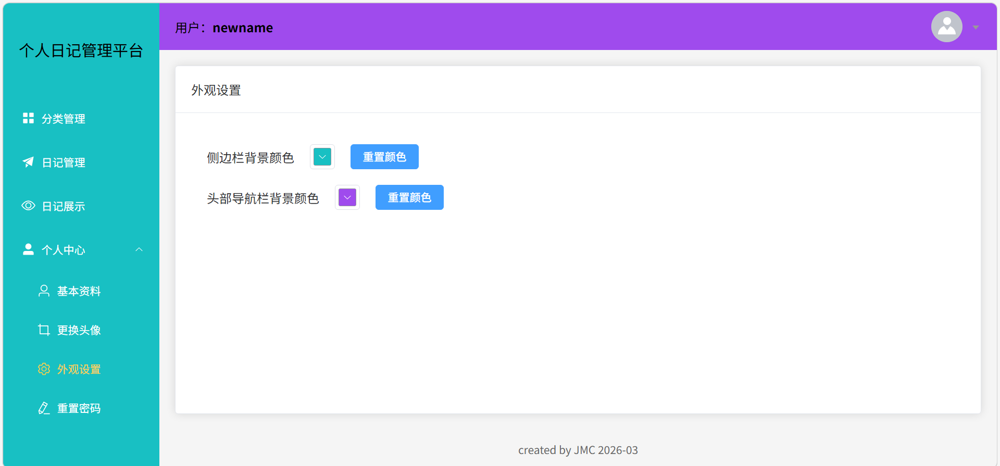

# 个人日记管理系统

一个后台数据管理系统，可以上传日记，管理日记。扩展了**个性化阅读、视图切换、外观自定义和文本搜索**等功能，提升用户交互体验。

## 技术栈

Vue3+JavaScript+Element Plus+Vite+Axios+Pina

## 运行软件和插件

Vscode+Vue (Official)

## 代码格式化和美化插件

eslint+prettier

## 运行方法

```sh
pnpm install
```

### 开发模式

```sh
pnpm dev
```

### 生产模式

```sh
pnpm build
```

## 核心功能

### 1 登录注册页面



### 2 日记管理页面



可以根据日记分类、发布状态搜索对应的日记，每个日记可以继续单独的编辑、删除操作。也可以新增日记。

**视图切换功能：**默认为表格视图，点击切换视图按钮，可以切换到图片视图，可以根据分页器中每页数量自适应布局，如下：





再次点击切换视图，可以回到表格视图。

点击编辑或新增日记会出现侧边栏。



### 3 日记展示页面

点击日记标题，可以进入日记展示模块。



**个性化阅读功能：**可以设置日记的背景颜色、字号



**全文搜索功能：**可以搜索日记中的文字，搜索结果会高亮显示


### 4 外观自定义页面

用户可以分别设置侧边栏背景颜色和头部导航栏背景颜色，满足个性化需求。点击重置颜色，会重置为系统默认颜色。


